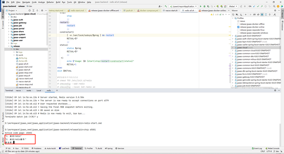
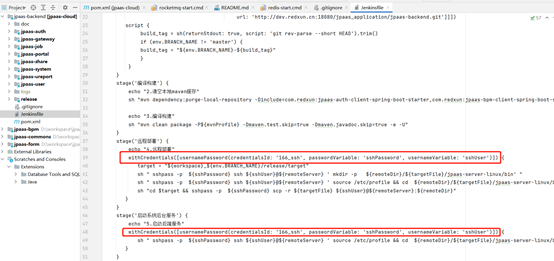
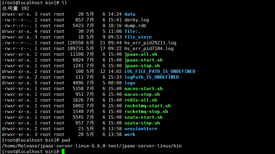
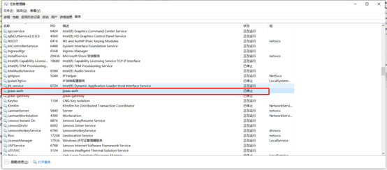
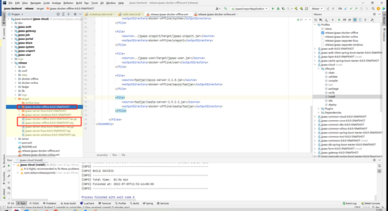

JPAAS-6.6.0版本环境手册
## 6.6.0
### 开发环境
#### Windows
推荐目前主流的windows10专业版。
##### 工具软件准备
具体的安装步骤及说明可以参考这里的文章：
http://doc.redxun.cn/docs/jpaas/jpEnvPre
###### Idea
推荐2021.1版本
###### JDK
安装1.8以上版本，推荐jdk1.8.0_202 64位版本。

###### MSQL
安装8以上版本，推荐8.0.25
###### NodeJS
推荐版本为v14.X系列，自带的npm版本默认为6系列，从官网下载安装，地址为：
http://nodejs.cn/download/
###### MAVEN(可选)
6.6.0版本集成了maven仓库配置，如果没有发布版本到私服的需求，可以直接用idea编辑器默认的maven。参考下图

###### Redis(可选)
6.6.0版本集成了redis启动脚本及可运行文件，目前版本为3.0.504，可参考下图

启动脚本为：

###### Rocket MQ(可选)
6.6.0版本集成了redis启动脚本及可运行文件，目前版本为4.9.3
###### Nginx(可选)
6.6.0版本集成了nginx启动脚本及可运行文件,以及进行nginx.conf默认配置，可参考下图

开发的配置文件已经集成配置好

###### NACOS(可选)
6.6.0版本集成了nacos启动脚本及可运行文件,版本为自编译2.1.0, 默认的命名空间为local, 需要自己创建，具体的启动位置为：

命名空间创建示例如下：

###### SEATA(可选)
6.6.0版本集成了seata启动脚本及可运行文件,版本为自编译1.5.2.1,具体的启动位置为：

###### HBuilder(可选)
如需要进行移动端开发及编译，打包，发布，需要安装。从官网安装即可，地址为：
https://www.dcloud.io/hbuilderx.html

##### jpaas-backend后端启动
###### 代码获取
http://dev.redxun.cn:18080/jpaas_application/jpaas-backend.git
导入idea编辑器
将前后端工程分别导入到idea编辑器，最终的结构如下：

###### 安装MYSQL8
安装MYSQL8系列版本，执行初始化脚本，注意MYSQL需要配置忽略大小写，如下图：

###### Redis启动
	进入项目的relase工程下的bin目录，直接在idea的Terminal下打开，执行redis-start.cmd
如下图所示：

可以输入数字1或者2，选择单次启动redis，或者以服务形式启动redis，如下图：

这里以单次启动，选择1，可以看到加载的配置文件，默认密码是redis，如下图：

###### Nacos启动
同redis一样进入release工程的bin目录，启动nacos-start.cmd, 如下图所示:

默认命名空间为local,导入nacos默认配置，配置文件位置如下：

启动效果如下：

###### Seata启动
同上进入release工程的bin目录，执行seata-start.bat命令启动，如下图：

启动成功可以看到会注册到nacos里面。

###### Rocketmq启动(可选)
Rokcetmq为系统的消息服务器，可以选择启动，也可以不启动，涉及功能有消息的发送及系统通知，日志相关。
同样进入release工程的bin目录, 执行rocketmq-start.cmd命令，如下图：

启动效果如下图：

分别为nameserver, broker, 以及监控界面。可以输入localhost:7777监控本机的rocketmq启动情况

###### Form启动
进入release工程的bin目录，执行jpaas-start.cmd,选择对应的数字1启动form

启动效果：

可以看到正常注册到nacos。
###### Bpm启动
进入release工程的bin目录，执行jpaas-start.cmd,如下图：

启动效果如下图：

可以看到bpm正常注册到nacos
###### 各个微服务启动
进入idea的View配置，配置Services面板，如下图：

依次启动各个微服务即可。

##### jpaas-front前端启动
###### 代码获取
http://dev.redxun.cn:18080/jpaas_application/jpaas-front.git

###### 启动nginx
进入前端项目的releae工程目录下，执行start.cmd启动nginx

这里会有2个选项，1为本地开发环境，2为生产环境，本地开发环境需要启动相关工程，生产环境则启动打包后的文件。
启动效果如下：

浏览器输入：http://localhost:8000,显示如下页面，则nginx启动成功

Nginx的配置文件在如下目录，需要修改的可以自行修改，完成后可以执行reload.cmd命令，重启nginx

###### jpaas-admin-front启动
进入jpaas-admin-front工程目录下，
执行npm install –registry=http://nexus.redxun.cn:18081/repository/npm-redxun-group安装
完成之后执行 npm run serve启动主应用工程。
启动效果

访问localhost:8000/jpaas,出现如下界面代表启动成功

#### Linux
待补充
#### MacOS
待补充

### 测试环境
#### Jenkins可持续集成
平台默认编写了jenkins自动化测试环境脚本，可以修改使用
1.首先安装带有ocean插件的jenkins，如下图：

2.增加服务器登录用户名，密码配置，如下图

3.修改系统的Jenkinsfile文件，使用对应的配置ID，如下图：

4.进入jenkins系统，创建流水线：如下图：

输入用户名，密码，或者沿用创建过的，

5.进入jenkins系统，执行扫描多分支流水线，则会将项目中的多分支扫描出来，并挨个进行配置执行。如下图：

6.然后执行流水线，则会安装Jenkinsfile定义的步骤进行自动化执行，如下图：

### 生产环境
6.6.0版本支持多种编译打包方式，如：jar包，docker离线，docker在线，windows服务，各种方式的编译打包步骤是一样的。
#### Linux
##### Jar包
1.	勾选模板release-jpaas-separate-linux,如下图所示：
      
      2.执行编译打包双击jpaas-cloud项目的install步骤，如下图所示：
      
      3.上述操作执行完成后，在release的target目录下会生成3个格式的文件，分别为zip格式，tar.gz格式，以及原始文件目录，如下图：
      
      4.可以将该压缩包直接复制到对应的生成服务器上。然后解压即可。
      5.进入解压目录，可以看到如下图所示文件，执行chmod a+x *.sh,给这些脚本相应的执行权限。
      

./nacos-start.sh  启动nacos
./seata-start.sh  启动seata
./redis-all.sh start  启动redis
./jpaas-all.sh start 启动jpaas各个微服务

#### Windows
##### 服务
1.勾选模板release-jpaas-separate-windows,如下图所示：

2.执行编译打包双击jpaas-cloud项目的install步骤，如下图所示：

3.上述操作执行完成后，在release的target目录下会生成2个格式的文件，分别为zip格式，原始文件目录，如下图：

4.可以将该压缩包直接复制到对应的windows产服务器上。解压目录
5.进入解压目录，可以看到如下图所示文件。

6.进入目录依次启动nacos，seata，rocketmq等服务
./nacos-start.cmd  启动nacos
./seata-start.bat  启动seata
./redis-start.cmd 启动redis
./rocketmq-start.cmd 启动rocketmq服务
7.进入winsw目录，执行如下安装windows服务操作，如下图：

此时可以看到任务管理器里面已经有安装的服务，如下图：

右键启动该服务即可，其他的服务比如：jpaas-system,jpaas-user, jpaas-portal, jpaas-ureport,jpaas-bpm,jpaas-form都可以按照该方式进行。可以在当前目录下查看相关日志信息，也可以设置开机自启动等操作，如下图所示：

#### Docker-compose
##### 离线
1.勾选模板release-jpaas-docker-offline,如下图所示：

2.执行编译打包双击jpaas-cloud项目的install步骤，如下图所示：

3.上述操作执行完成后，在release的target目录下会生成3个格式的文件，分别为zip格式，tar.gz格式，以及原始文件目录，如下图：

4.可以将该压缩包直接复制到对应的生成服务器上。然后解压即可。
5.进入解压目录，可以看到如下图所示文件，。

6.执行chmod a+x *.sh,给这些脚本相应的执行权限.
7. 执行./build.sh,检查本机docker环境，如果没有按照，则build.sh脚本文件会自动安装docker以及docker-compose。
   8.启动数据库
#docker-compose up -d mysql
查看日志
#docker-compose logs -f mysql
验证：使用客户端工具测试连接即可。
端口默认3306
账号/密码：root/root
提示：优先保证数据库正常启动，如果有脚本问题，请执行下图中对应目录的mysql脚本。

###### Redis启动
#docker-compose up -d redis
备注：redis密码为:redxun
###### Nacos启动
#docker-compose up -d nacos
验证：ip:8848/nacos访问
账号/密码：nacos/nacos
默认命名空间为local
###### Seata启动
#docker-compose up -d seata
验证：访问nacos后在服务列表可查看seata是否成功注册。
###### 应用批量启动
批量启动其他应用
#docker-compose up -d
###### 应用单独启动
单独启动应用
#docker-compose up -d gateway
#docker-compose up -d auth
#docker-compose up -d user
#docker-compose up -d system
#docker-compose up -d bpm
#docker-compose up -d form
#docker-compose up -d portal
#docker-compose up -d job
#docker-compose up -d ureport
###### 访问平台
服务器IP:8000/jpaas
账号/密码：admin/admin
##### 在线
1.勾选模板release-jpaas-docker-online,如下图所示：

2.执行编译打包双击jpaas-cloud项目的install步骤，如下图所示：

3.上述操作执行完成后，在release的target目录下会生成3个格式的文件，分别为zip格式，tar.gz格式，以及原始文件目录，如下图：

4.可以将该压缩包直接复制到对应的生成服务器上。然后解压即可。
5.进入解压目录，可以看到如下图所示文件，。

6.执行chmod a+x *.sh,给这些脚本相应的执行权限.
7. 执行./build.sh,检查本机docker环境，如果没有按照，则build.sh脚本文件会自动按照docker以及docker-compose。
   8.启动数据库
#docker-compose up -d mysql
查看日志
#docker-compose logs -f mysql
验证：使用客户端工具测试连接即可。
端口默认3306
账号/密码：root/root
提示：优先保证数据库正常启动，如果有脚本问题，请执行下图中对应目录的mysql脚本。

###### Redis启动
#docker-compose up -d redis
备注：redis密码为:redxun
###### Nacos启动
#docker-compose up -d nacos
验证：ip:8848/nacos访问
账号/密码：nacos/nacos
默认命名空间为local
###### Seata启动
#docker-compose up -d seata
验证：访问nacos后在服务列表可查看seata是否成功注册。
###### 应用批量启动
批量启动其他应用
#docker-compose up -d
###### 应用单独启动
单独启动应用
#docker-compose up -d gateway
#docker-compose up -d auth
#docker-compose up -d user
#docker-compose up -d system
#docker-compose up -d bpm
#docker-compose up -d form
#docker-compose up -d portal
#docker-compose up -d job
#docker-compose up -d ureport
###### 访问平台
服务器IP:8000/jpaas
账号/密码：admin/admin
