jpaas-windows-separate-enc体验包运行手册
###  安装加密授权码工具

#### 下载客户端工具
地址：https://lm.virbox.com/tools.html
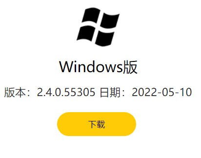

#### 添加授权码
这个授权码可以向我司获取。
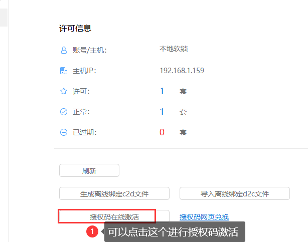

#### 执行数据库脚本
数据库配置忽略大小写，切记！！！
lower_case_table_names = 1
按照顺序执行数据库脚本
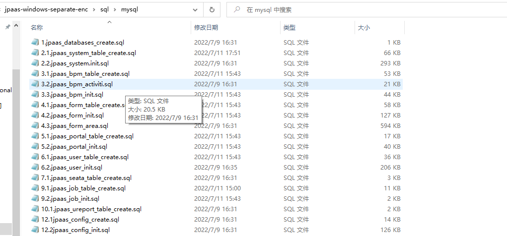

#### 启动redis
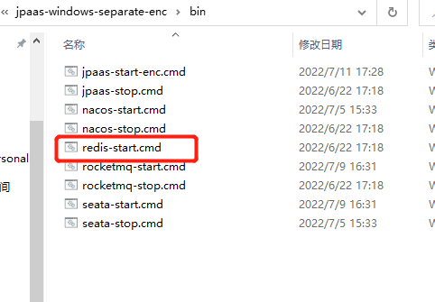
选择1或者2，这里选择1，单次启动redis，默认密码是redis
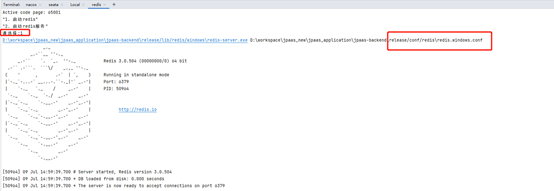

#### 启动nacos
点击nacos-start.cmd启动nacos
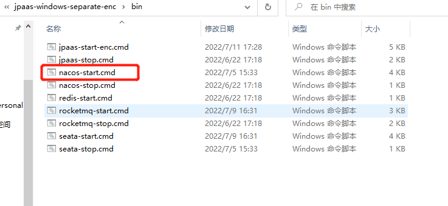
创建默认命名空间local

导入nacos配置

选择配置文件

查看是否需要修改配置，比如数据库连接信息，redis配置信息
nacos-config-dev.properties
j2cache-dev.properties

#### 启动seata
运行下述文件：
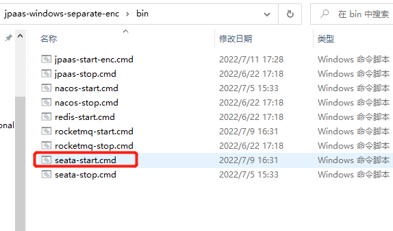，
检查seata是否注册到nacos
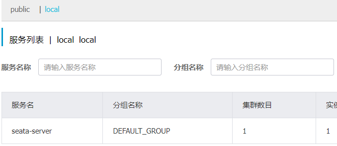

#### 启动jpaas微服务

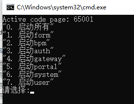
选择单个启动某个服务，或者启动所有服务，最后检查nacos是否服务都注册成功
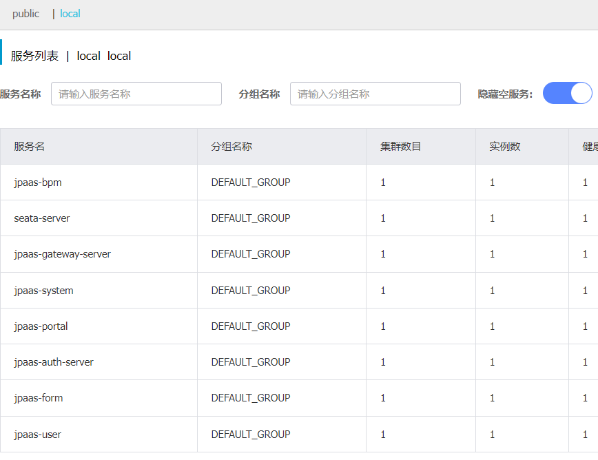

#### 前端运行
进入下图目录，执行start.cmd, 在浏览器种输入http://localhost:8000/jpaas,检查系统是否可正常登录
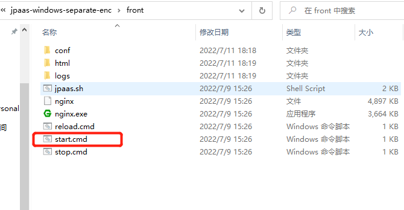
